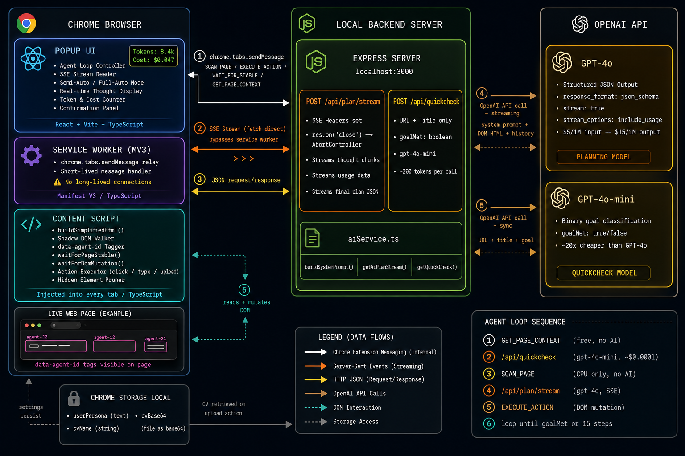

# Orbital — AI Browser Agent

[](#)
[](https://www.typescriptlang.org/)
[](https://reactjs.org/)
[](https://nodejs.org/)
[](https://openai.com/)
[](https://developer.chrome.com/docs/extensions/mv3/)

**Orbital is a Chrome Extension that turns natural language into browser actions.**

Type what you want. The agent reads the live page, reasons about it, plans a sequence of actions, and executes — click by click, field by field — until the goal is met. No Selenium. No hand-written selectors. No scripting. Natural language workflows powered by semantic DOM understanding and structured browser automation.


*60-second walkthrough: searching Google, filling a multi-field form, and auto-uploading a CV to a job application.*

---

## Table of Contents

1. [How It Works](#how-it-works)
2. [System Architecture](#system-architecture)
3. [Architecture & Engineering Decisions](#architecture--engineering-decisions)
4. [Agent Loop Deep Dive](#agent-loop-deep-dive)
5. [Reliability & Benchmarks](#reliability--benchmarks)
6. [Cost Optimization Strategy](#cost-optimization-strategy)
7. [Known Limitations](#known-limitations)
8. [Key Features](#key-features)
9. [Tech Stack](#tech-stack)
10. [Local Setup](#local-setup)
11. [Project Structure](#project-structure)

---

## How It Works

1. **Intent** — User types a goal: *"Find me a chicken curry recipe"* or *"Fill out this job application with my info"*
2. **Scan** — The content script recursively walks the live DOM, compressing a 400KB page into a ~26KB semantically meaningful HTML snapshot
3. **Reason** — GPT-4o receives the snapshot, page context, and action history. It streams back a structured plan: `{ thought, actions[], taskCompleted }`
4. **Execute** — Each action (`click`, `type`, `upload`) is dispatched to the content script, which waits for DOM mutations or URL changes to confirm success
5. **Loop** — The agent re-evaluates after each step, adapts to failures, and terminates only when the goal is provably met

---

## System Architecture



**Data flow per agent step:**

```
Popup → GET_PAGE_CONTEXT → QuickCheck API → (if needed) SCAN_PAGE → Stream Plan API → EXECUTE_ACTION → repeat
```

---

## Architecture & Engineering Decisions

### 1. DOM Representation: Surgical HTML Reduction

Raw page HTML is unworkable — a typical Google search results page is 400–800KB. Sending it verbatim would cost ~$0.80 per step and overflow most context windows.

`buildSimplifiedHtml()` in the content script produces a precise, agent-readable reduction:

- **Noise elimination**: `script`, `style`, `svg`, `iframe`, `img`, `video`, `noscript`, `meta`, and `link` tags are stripped entirely
- **Recursive visibility enforcement**: `getComputedStyle()` is called on every element — `display: none`, `visibility: hidden`, and `opacity: 0` containers are excluded at the parent level, not just at leaf nodes. Hidden modals, off-screen menus, and collapsed dropdowns never reach the model
- **Interactive element tagging**: Every `button`, `input`, `a`, `select`, `textarea`, `role="button"`, and `role="link"` receives a deterministic `data-agent-id` (`agent-0`, `agent-1`, ...) and a visible magenta outline on the live page, giving the AI a stable targeting reference
- **Text truncation**: Text nodes longer than 100 characters are truncated unless inside interactive labels, buttons, or headings. Recipe pages, article bodies, and documentation shrink dramatically without losing navigational context
- **Shadow DOM traversal**: The scanner walks `el.shadowRoot` recursively, enabling compatibility with YouTube, Google's Material components, and other modern apps that isolate UI in shadow trees — where standard DOM scrapers fail silently
- **Agent ID cleanup**: Every scan cycle strips all previous `data-agent-id` attributes before reassignment. Without this, step 2+ would target stale elements from the previous scan — a silent correctness bug that causes the agent to act on the wrong element

**Result**: A 400KB Google results page compresses to ~26KB. A recipe page: 800KB → ~38KB.

---

### 2. Two-Phase Goal Detection

Scanning a full DOM and calling GPT-4o to confirm "yes, you're already on the right page" wastes time and money. Orbital uses a tiered detection strategy before committing to an expensive call:

| Phase | Action | Cost |
|---|---|---|
| `GET_PAGE_CONTEXT` | Synchronous message → URL + title | Free |
| `POST /api/quickcheck` | URL + title + goal → `gpt-4o-mini` | ~$0.0001 |
| `POST /api/plan/stream` | Full DOM + history → `gpt-4o` | ~$0.04–0.08 |

If the page title alone satisfies the goal (e.g., landing on *"Indian Chicken Curry Recipe"*), the agent terminates without ever running the full scan. The `gpt-4o-mini` quickcheck costs 20x less than `gpt-4o` and achieves identical accuracy on binary classification — routing by task complexity is the most impactful cost lever in agentic systems.

---

### 3. Streaming Architecture: Direct Popup → SSE → OpenAI

The agent streams GPT-4o's reasoning in real time using **Server-Sent Events (SSE)**. The popup connects directly to the Express backend — intentionally bypassing the Chrome service worker.

**The MV3 problem**: Chrome Manifest V3 service workers are designed for short-lived event handlers, not long-held HTTP connections. A streaming `fetch` inside an `onMessage` async handler gets killed mid-stream as the worker goes dormant. Critically, `req.on('close')` on the Node side fires the moment the POST body is consumed — not when the SSE client actually disconnects — causing the `AbortController` to abort the OpenAI request before any tokens stream back.

**The fix**: The popup is a real browser window with no lifetime constraints. It fetches directly to `localhost:3000`, holds the SSE connection open, and reads chunks via a streaming `ReadableStream` reader. The service worker is retained only for `chrome.tabs.sendMessage` calls, where short-lived handlers are the correct model.

**SSE event protocol:**
```
data: { type: "thought", data: "I can see a search bar on this page..." }
data: { type: "usage",   data: { prompt_tokens: 8420, completion_tokens: 180 } }
data: { type: "plan",    data: { thought, taskCompleted, actions[] } }
data: { type: "error",   data: "Failed to parse AI plan." }
```

Thought tokens stream character-by-character using an incremental regex (`/"thought"\s*:\s*"((?:[^"\\]|\\.)*)/`) that correctly handles mid-stream JSON escape sequences — the user watches the AI reason in real time rather than waiting 5–8 seconds for a silent black-box response.

---

### 4. Page Stability Detection

After every click, the agent must know when the page has settled before scanning again. Hardcoded `setTimeout` sleeps are unreliable — fast sites trip them early, slow sites waste time.

`waitForPageStable()` implements a two-layer check:

1. **`document.readyState` gate**: blocks until `'complete'`, preventing false positives during active page loads
2. **Mutation idle debounce**: a `MutationObserver` watches the full DOM subtree. Any mutation resets a 500ms debounce timer. Stability is declared after 500ms of silence
3. **Hard ceiling**: a configurable `timeoutMs` (default 5000ms) guarantees forward progress on continuously-animated pages

This correctly handles SPAs (React, Vue, Angular) where URL changes and DOM mutations are fully decoupled from `readyState` transitions.

---

### 5. Action Execution

Three action primitives form the entire action space:

**`click`** — Calls `.click()` on the targeted element, then monitors for DOM mutation or URL change via `waitForDomMutation(3000)`. A dead click (no page reaction within 3 seconds) is logged with context and fed back to the AI as a failure signal, prompting a new approach on the next step.

**`type`** — Sets `.value` and dispatches synthetic `input` and `change` events with `bubbles: true`. This is required for React and Vue controlled components, which ignore native DOM value changes and only respond to React's synthetic event system. For `<select>` elements, options are matched against both `.value` and `.text.trim()`, handling cases where option values are opaque internal IDs.

**`upload`** — Retrieves the stored file from `chrome.storage.local` (saved as base64 in the Settings vault), reconstructs a typed `File` object, and injects it via the `DataTransfer` hack. Browsers block direct `.value` assignment on `<input type="file">` as a security measure — the `DataTransfer` object is the only reliable programmatic bypass.

---

### 6. Prompt Engineering Architecture

The system prompt is assembled dynamically by `buildSystemPrompt()` with four layered sections:

- **GOAL DETECTION**: Forces the model to evaluate URL + title before planning any action. Prevents redundant clicks on pages where the goal is already met
- **ANTI-LOOP & FORM RULES**: Encodes hard-won failure modes — re-filling already-correct fields, blind sequential form filling, misreading `<select>` option IDs, repeating dead clicks, and ignoring navigation history
- **STATE MACHINE**: Defines explicit, unambiguous completion criteria per task type. Prevents false-positive completion (*"I searched — done"*) and false-negative loops (*"I'm on the recipe page, should I keep clicking?"*)
- **PERSONA ENGINE + FILE VAULT** (conditional): Appended only when data is present, keeping the base prompt lean for tasks that don't require personal data

---

### 7. History Management & Context Window Safety

The agent maintains a rolling `localHistory` array — a structured log of what the AI decided and what actually happened:

```
[STEP 2] CLICKED "agent-20". SUCCESS: Page URL changed. Assess new page.
[STEP 2 THOUGHT]: Search results visible. I'll click the first recipe link.
[STEP 3] Element "agent-14" missing. Page may have re-rendered. Evaluate new DOM.
```

History is capped at 10 entries via a `shift()` rolling window. Older entries are discarded to prevent context overflow — a silent failure mode where accumulated history eventually exceeds the model's context window, causing hallucinations or degraded planning.

---

## Agent Loop Deep Dive

```
runAgent()
  │
  ├── GET_PAGE_CONTEXT (free — no AI call)
  │
  ├── POST /api/quickcheck (gpt-4o-mini, ~200 tokens, ~$0.0001)
  │     ├── goalMet: true  ──────────────────────► MISSION ACCOMPLISHED ✓
  │     └── goalMet: false → continue
  │
  ├── SCAN_PAGE (content script, CPU only — no API call)
  │
  ├── POST /api/plan/stream (gpt-4o, SSE)
  │     ├── streams thought tokens  → displayed character-by-character
  │     ├── emits usage event       → token + cost counter updated live
  │     └── emits plan event        → { thought, taskCompleted, actions[] }
  │
  ├── [SEMI-AUTO MODE] awaitConfirmation()
  │     ├── approved → continue
  │     └── rejected → halt
  │
  ├── for each action in plan.actions:
  │     ├── EXECUTE_ACTION → content script
  │     │     ├── click   → waitForDomMutation(3000ms)
  │     │     ├── type    → set .value + dispatch bubbling events
  │     │     └── upload  → DataTransfer + File reconstruction
  │     │
  │     ├── success (URL changed)   → history entry, waitForPageStable(5000ms)
  │     ├── success (DOM mutated)   → history entry, waitForPageStable(3000ms)
  │     ├── dead click              → warning, history entry, break
  │     └── element not found      → contextual warning, history entry, break
  │
  ├── trim history to 10 entries (rolling window)
  └── loop — max 15 steps
```

---

## Reliability & Benchmarks

> Tested manually across common workflow types on real websites. Results reflect actual agent behavior including retries and failure recovery.

| Workflow Type | Tested | Succeeded | Success Rate |
|---|---|---|---|
| Google search + open result | — | — | —% |
| Multi-field form fill (with persona) | — | — | —% |
| CV upload to job application | — | — | —% |
| YouTube search + play video | — | — | —% |
| E-commerce search + open product | — | — | —% |

**Average steps per completed task:** —

**Average cost per completed task:** —

> *Benchmarks collected manually across real websites. Results vary with page complexity, DOM structure, and site-specific rendering behavior.*

---

## Cost Optimization Strategy

| Optimization | Mechanism | Impact |
|---|---|---|
| Tiered model routing | `gpt-4o-mini` for binary goal classification | 20x cost reduction on completion checks |
| DOM text truncation | 100-char limit on non-interactive text nodes | ~40–60% input token reduction on content pages |
| Recursive visibility pruning | `getComputedStyle()` container-level filter | Eliminates hidden element noise before tokenization |
| Rolling history window | `shift()` at 10 entries | Prevents context overflow in long sessions |
| Accurate cost metering | Separate input/output pricing ($5 / $15 per 1M tokens) | Correct display vs. blended-rate overestimation |

**Observed costs per task type:**
- Simple search + navigation: ~$0.05–0.10
- Multi-field form fill: ~$0.08–0.15
- CV drop (navigate + upload): ~$0.10–0.20

---

## Known Limitations

Orbital is designed for reliability on structured, predictable workflows — not unrestricted open-ended browsing. Understanding where it performs well matters as much as understanding what it can do.

- **Canvas and WebGL interfaces**: Pages that render primarily via `<canvas>` (Figma, Google Maps, some dashboards) have no accessible DOM tree. The agent cannot target elements that don't exist in HTML
- **Heavy React re-renders**: Aggressive client-side re-renders can invalidate `data-agent-id` assignments mid-step. The agent detects and recovers from missing elements, but SPAs with rapid state mutations may require multiple retries
- **Authentication walls**: The agent operates on visible page state only. OAuth flows, CAPTCHAs, and 2FA checkpoints require manual user intervention at the blocked step
- **Ambiguous goals**: Vague instructions (*"do something useful here"*) produce unpredictable results. The agent performs best when the goal is specific and has a clear, verifiable completion state
- **Continuously animated pages**: Live feeds and auto-refreshing dashboards may interfere with the 500ms mutation idle detector in `waitForPageStable()`, causing premature or delayed step transitions
- **Long sessions on content-heavy pages**: DOM snapshots near the 80k character limit accumulate significant token cost. Sessions exceeding ~10 steps on large pages may see increased cost and gradually degraded reasoning

---

## Key Features

**Semi-Auto & Full-Auto Modes** — Semi-Auto pauses before every action batch, showing the AI's full reasoning and planned actions for user review and approval. Full-Auto executes without interruption. Semi-Auto is the recommended mode for new workflows or sensitive pages.

**Real-Time Thought Streaming** — The AI's reasoning streams character-by-character as tokens generate. The user sees *why* each decision is made — transparency over black-box execution. Built on SSE with incremental JSON extraction.

**Persona Engine** — Store personal data (name, email, phone, LinkedIn, address) once in the Settings tab. When the agent encounters any form, it maps fields intelligently using surrounding HTML context and label analysis — not blind sequential filling.

**File Vault** — Upload a CV or document once (PDF/DOC, max 10MB), stored locally as base64 in `chrome.storage.local`. On any file upload input, the agent reconstructs and injects the file programmatically.

**Session Cost Counter** — Live token count and dollar cost in the header, updated per-step with separate input ($5/1M) and output ($15/1M) pricing. Shifts to a warning state at 50k tokens.

**Graceful Cancellation** — `AbortController` propagates from popup fetch → Express `res.on('close')` → OpenAI streaming request. STOP cleanly cancels the entire chain with no dangling connections or background token spend.

---

## Tech Stack

| Category | Technology |
|---|---|
| **Chrome Extension** | Manifest V3, TypeScript |
| **Frontend** | React, Vite, CSS |
| **Backend** | Node.js, Express, TypeScript |
| **AI — Planning** | OpenAI GPT-4o (streaming, structured JSON output) |
| **AI — Goal Check** | OpenAI GPT-4o-mini (sync, binary classification) |
| **Streaming Protocol** | Server-Sent Events (SSE) |
| **Local Storage** | chrome.storage.local (persona + CV vault) |

---

## Local Setup

**Prerequisites:** Node.js 18+, OpenAI API key, Chrome

**1. Clone the repository**
```bash
git clone https://github.com/your-username/orbital-agent
cd orbital-agent
```

**2. Start the backend**
```bash
cd ChromeExtention_Backend
npm install
# Create a .env file and add:
# OPENAI_API_KEY=sk-...
npm run dev
```
Server runs on `http://localhost:3000`.

**3. Build the extension**
```bash
cd ChromeExtention
npm install
npm run build
```

**4. Load in Chrome**
- Go to `chrome://extensions`
- Enable **Developer Mode** (toggle, top right)
- Click **Load unpacked**
- Select the `ChromeExtention/dist` folder

**5. Set up your persona** *(recommended)*

Open Orbital → **SETTINGS** tab → enter personal details → optionally upload a CV.

**6. Run your first mission**

Navigate to any website, open Orbital, type a goal, and press **RUN_MISSION**.

---

## Project Structure

```
orbital-agent/
│
├── ChromeExtention/                    # Chrome Extension (React + Vite)
│   ├── src/
│   │   ├── popup/
│   │   │   ├── Popup.tsx               # Agent loop, SSE stream reader, UI state
│   │   │   └── Popup.css
│   │   ├── content/
│   │   │   └── index.ts               # DOM scanner, action executor, stability detection
│   │   ├── background/
│   │   │   └── index.ts               # MV3 service worker — lightweight message relay
│   │   └── types/
│   │       └── index.ts               # Shared TypeScript interfaces
│   ├── manifest.json
│   └── vite.config.ts
│
└── ChromeExtention_Backend/            # Node.js + Express Backend
    ├── src/
    │   ├── index.ts                    # Express routes, SSE setup, AbortController wiring
    │   ├── aiService.ts                # GPT-4o streaming, quickcheck, prompt builder
    │   └── types.ts                    # ActionPlan, DOMElement, Action interfaces
    └── .env                            # OPENAI_API_KEY
```